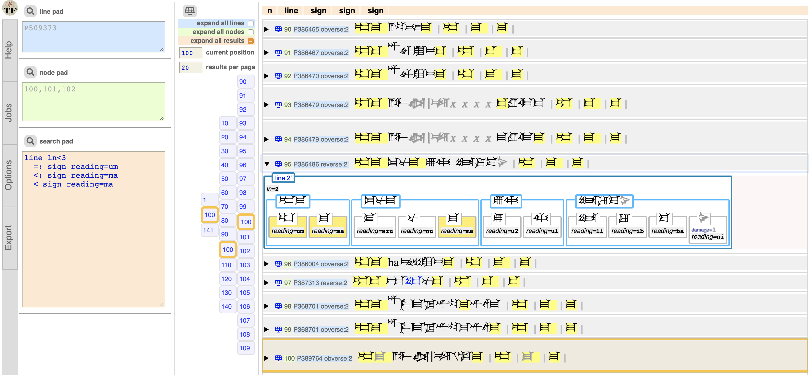

# Old Babylonian Letters

This is a
[Text-Fabric](https://github.com/annotation/text-fabric) app
for working with
[Old Babylonian](https://github.com/Nino-cunei/oldbabylonian) letters: Cuneiform Tablets from the Old Babylonian (1900-1600 BC) period.

Get started with the
[tutorial](https://nbviewer.jupyter.org/github/annotation/tutorials/blob/master/oldbabylonian/start.ipynb).

[Additional API](api.md)

See also
[about](https://github.com/Nino-cunei/oldbabylonian/blob/master/docs/about.md),
[transcription](https://github.com/Nino-cunei/tfFromAtf/blob/master/docs/transcription.md).

# Author

[Dirk Roorda](https://github.com/dirkroorda)

